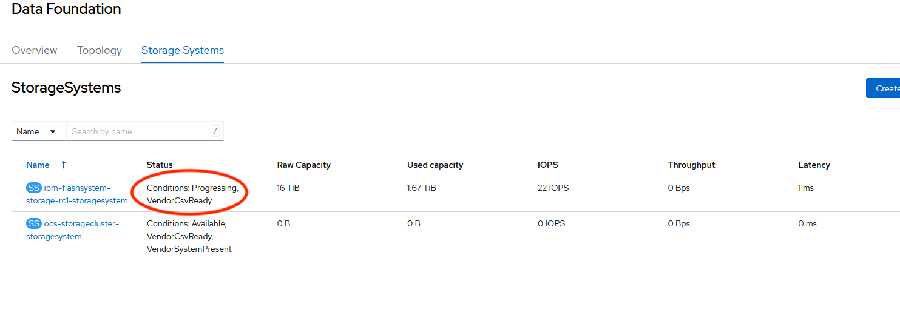

# Known issues

###  Storage system status stuck on 'Progressing'
##### Problem: 
in some circumstances, after adding FlashSystem as external storage, some Flash storage system might get stuck on 'Progressing' state due to a status sync delay on RedHat ODF operator.
##### Detected in version: 
ODF 4.13 using ODF-FS 1.4.0 
##### Problem Verification: 
On Openshift Console go to Storage -> Data Foundation -> storage systems. Some storage systems might be stuck forever with a status of: "Progressing" and never changes to "Available"

##### Workaround:
1. SSH into OCP cluster
2. Switch to openshift-storage namespace by running:   
$ oc project openshift-storage
3. List all pods in namespace by running:   
$ oc get pods   
Look for a pod with prefix: odf-operator-controller-manager-*
4. Delete the pod found in the previous step by running:   
$ oc delete pod {odf-operator-controller-manager-*}  
5. The pod will be recreated automatically, verify pod creation by running:   
$ oc get pods | grep odf-operator-controller-manager  
6. Storage system status should change to 'Available' after a few minutes.

##### Links:
https://bugzilla.redhat.com/show_bug.cgi?id=2207619  
https://jira.xiv.ibm.com/browse/ODF-448  

