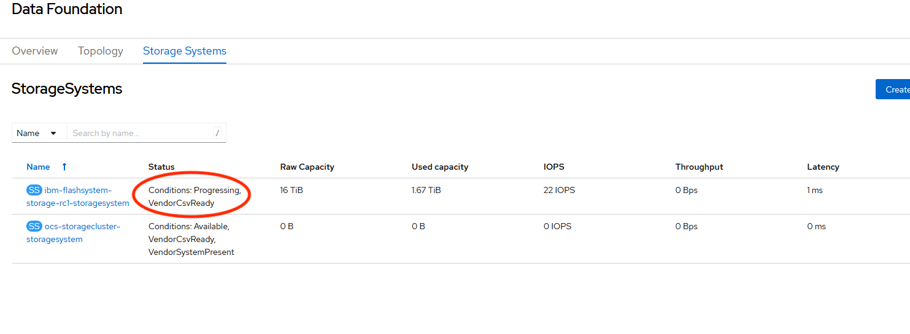

# Known issues

###  Storage system status stuck on 'Progressing'
##### Problem: 
In some specific circumstances, after adding an IBM Storage Virtualize® family storage system as an external storage, some storage systems might get stuck on 'Progressing' state due to a status sync delay on Red Hat® ODF operator.
##### Detected in version: 
Red Hat® ODF 4.13 using IBM® ODF FlashSystem driver 1.4.x
##### Problem verification: 
In the Red Hat Openshift® console, go to Storage -> Data Foundation -> storage systems. Some storage systems might be stuck forever with a status of: "Progressing" and never changes to "Available".


##### Workaround:
1. SSH into the OCP cluster
2. Switch to the "openshift-storage" namespace by running:
```
$ oc project openshift-storage
```
3. Find the "odf-controller-manager" pod by running:
```
$ oc get pods | grep odf-operator-controller-manager
```
4. Delete the pod found in the previous step by running:
```
$ oc delete pod {odf-operator-controller-manager-*}  
```
5. The pod will be recreated automatically, verify pod creation by running:
```
$ oc get pods | grep odf-operator-controller-manager  
```
6. THe storage system status should change to 'Available' after a few minutes


##### Links:
https://bugzilla.redhat.com/show_bug.cgi?id=2207619 <br>
https://jira.xiv.ibm.com/browse/ODF-448  


### IBM ODF FlashSystem driver console pod failing due to OOMKilled failure
##### Problem:
The IBM® ODF FlashSystem driver console pod fails continuously in a CrashLoopBackOff. The IBM® ODF FlashSystem operator reports that the failure reason is due to OOMKilled (error 137).

##### Detected in version:
All Red Hat® ODF versions running the IBM® ODF FlashSystem driver

##### Problem verification:
1. The IBM® ODF FlashSystem driver console pod failure reason can be extracted with the 'oc describe' command on the IBM® ODF FlashSystem operator pod. Failure reason will be OOMKilled (error 137).
2. Any attempt to delete the IBM® ODF FlashSystem driver console pod fails in the same way.
3. The IBM® ODF FlashSystem driver console pod's log itself does not show any meaningful information as the pod cannot start.

##### Workaround:
1. SSH into OCP cluster
2. Switch to the "openshift-storage" namespace by running:
```
$ oc project openshift-storage
```
3. Download and edit the IBM® ODF FlashSystem operator subscription by running:
```
$ oc edit subscription -n openshift-storage ibm-storage-odf-operator
```
4. Add the following lines in the <b>spec</b> section. Please note the indentation, and that all should be <b>lower case</b>
```
        config:
            resources:
                limits:
                    cpu:     50m
                    memory:  1000Mi
                requests:
                    cpu:     50m
                    memory:  1000Mi
```
5. Save and close the file. The subscription will be automatically applied to the cluster, and the IBM® ODF FlashSystem driver pods will be redeployed
6. Confirm all the IBM® ODF FlashSystem driver pods are functioning by running:
```
$ oc get pods
```

##### Notes:
Changing the IBM® ODF FlashSystem operator subscription will update the memory limit for all deployments in the subscription (ODF console, operator and sidecars). <br>
However, changing the IBM® ODF FlashSystem operator subscription will be preserved through upgrades, so it won't need to be changed again when upgrading to a future version.

##### Links:
https://jira.xiv.ibm.com/browse/ODF-579
